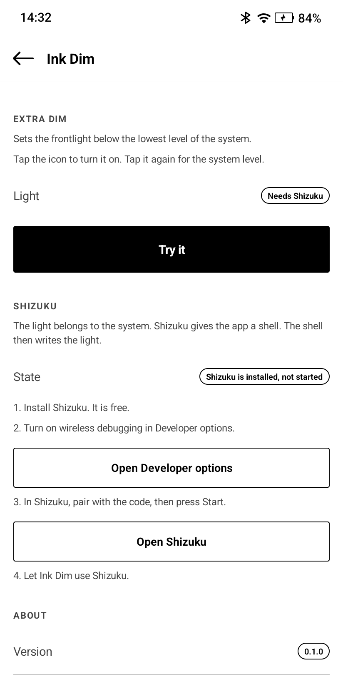

# Ink Dim

Sets the frontlight below the lowest level of the system.

Tap the icon. The light goes to the lowest level the hardware still lights.
Tap it again. The light goes back to the level the system holds.

The app has no screen. The icon is the whole app.

Made for the Viwoods AiPaper readers.

## Screenshots

  

The picture is from a Viwoods AiPaper Reader.

## Why the app needs Shizuku

The system will not set the frontlight below its own floor. Ask for less
through any official route and the light snaps to zero. So the app writes the
light of the panel straight, at
`/sys/class/leds/lcd-backlight/brightness`.

That file belongs to the user `system`. An app cannot write it, and a plain
shell user cannot write it either. The AiPaper Reader that this was made on has
a userdebug build, where the shell user may run `su 0`. On a reader with
another build, the app says that it could not set the light. So the app asks Shizuku for a shell, and the
shell writes the file through `su 0`.

Shizuku is a separate free app. You start it from the device through wireless
debugging. There is no computer and no root.

Long press the icon and open **Settings** for the steps, with a button for each
one.

## Install

Download the APK from the Releases page and install it.

Then long press the icon, open **Settings**, and follow the steps.

## Use

- Tap the icon. The light goes down.
- Tap the icon again. The light goes back to the system level.
- Long press the icon for **Settings**.

The value holds across sleep. It holds until the system brightness is next set.

## Quick settings tile

The tile is called **Extra dim**. Add it to the quick settings panel, then tap
it. The tile does the same as the icon, and it shows the state.

## Start it from somewhere else

Three intent actions:

    dev.equwal.inkdim.TOGGLE
    dev.equwal.inkdim.ON
    dev.equwal.inkdim.OFF

Example with adb:

    adb shell am start -a dev.equwal.inkdim.TOGGLE

## Put it on a hardware button

[Rebind](https://github.com/equwal/rebind) remaps the buttons of an e-ink
reader or any Android device. It can put this toggle on a hardware button: bind
the button to the action `dev.equwal.inkdim.TOGGLE`. Rebind is from the same
maker.

More extensions: [Awesome Rebind](https://github.com/equwal/awesome-rebind).

## Say thanks

Ink Dim is free and open source. If it made your device better, you can
[buy me a coffee](https://ko-fi.com/truex).

## Build

You need JDK 17 or later and the Android SDK, with platform 36.

    ./gradlew testReleaseUnitTest assembleRelease

The APK is in `app/build/outputs/apk/release/`.

Release signing is optional. Put a `keystore.properties` file in the root of
the project with `storeFile`, `storePassword`, `keyAlias` and `keyPassword`.
Without that file the build makes an unsigned APK.

## More projects

- [SubRead](https://subread.space/): read along with an audiobook, in the browser.
  Also [for Android](https://github.com/equwal/subread-android/releases/latest),
  [for YouTube](https://github.com/equwal/subread-extension/releases/latest)
  and [for KOReader](https://github.com/equwal/subread.koplugin).
- [SubRead Overlay](https://github.com/equwal/subread-overlay/releases/latest): subtitle lines over any Android media player.
- [SubRead Dictionary](https://github.com/equwal/subread-dictionary/releases/latest): a pop-up dictionary for Android that reads Yomitan dictionaries.
- [SubRead Anki](https://github.com/equwal/subread-anki): one tap makes an Anki card from any Android app.
- [Subrep](https://github.com/equwal/subrep-android/releases/latest): live captions of the sound of your phone.
- [Book Simulator](https://booksimulator.com/): a reading room for Aozora Bunko and Project Gutenberg books.
- [honjimaku.com](https://honjimaku.com/): subtitles for Japanese audiobooks.
- [sbm Sync](https://sbmsync.com/): your bookmarks, the same on every device,
  with [sbm](https://github.com/equwal/sbm) for dmenu,
  [sbm for Android](https://github.com/equwal/sbm-android/releases/latest)
  and the [sbm add-on](https://github.com/equwal/sbm-extension/releases/latest) for Firefox and Chrome.
- [Rebind](https://github.com/equwal/rebind/releases): remap the hardware buttons of e-ink readers and Android,
  with [Ink Recents](https://github.com/equwal/ink-recents/releases/latest),
  [Ink Dim](https://github.com/equwal/ink-dim/releases/latest)
  and [Ink Update](https://github.com/equwal/ink-update/releases/latest).
- [dickt.store](https://dickt.store/): language-learning tools, flashcards and web toys.
- [hentaibun.online](https://hentaibun.online/): learn kanbun and kobun.
- [Recently Written](https://recentlywritten.com/): the blog, and a list of [all projects](https://recentlywritten.com/projects.html).

## Licence

GPL-3.0-or-later. See [LICENSE](LICENSE).

Copyright (c) 2026 equwal.
